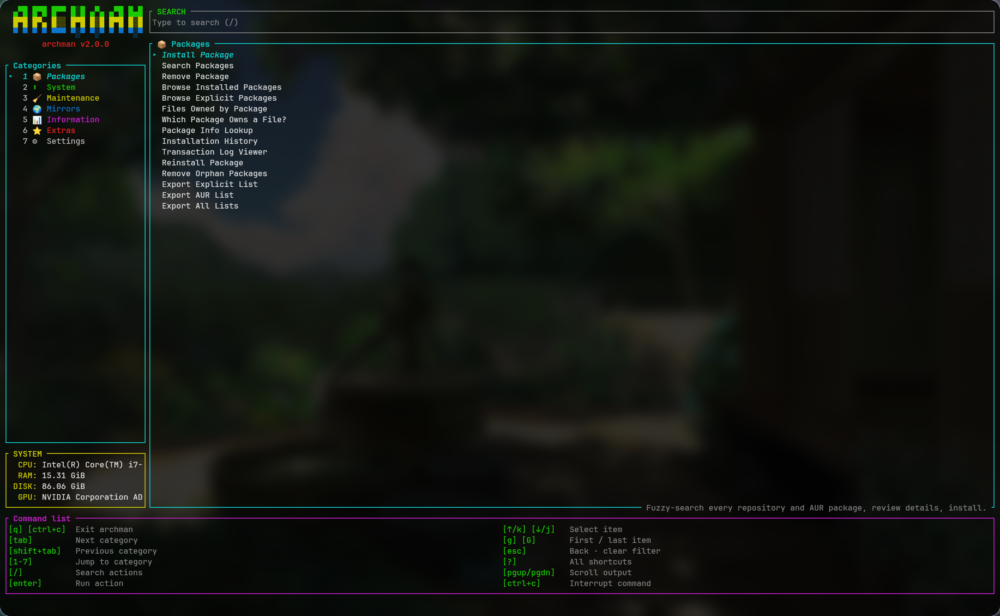

# archman — Interactive Arch Linux System Manager

<p align="center">
  <b>A fast, keyboard-driven terminal dashboard for managing your Arch Linux system.</b>
</p>

<p align="center">
  <a href="https://www.archlinux.org/"></a>
  <a href="https://www.rust-lang.org/"></a>
  
  <a href="LICENSE"></a>
</p>

---

**archman** is a native **Rust** TUI (built on [ratatui](https://github.com/ratatui/ratatui) + [crossterm](https://github.com/crossterm-rs/crossterm)) inspired by [LinUtil](https://github.com/ChrisTitusTech/linutil). Everything lives in one dashboard: a category sidebar with live system info, a flat action list with descriptions, a global search, and an embedded command runner — pacman, AUR helpers and reflector execute *inside the pane*, with your keystrokes (sudo passwords, `[Y/n]` prompts) forwarded straight to them.

```
 █████╗ ██████╗  ██████╗██╗  ██╗███╗   ███╗ █████╗ ███╗   ██╗
██╔══██╗██╔══██╗██╔════╝██║  ██║████╗ ████║██╔══██║████╗  ██║
███████║██████╔╝██║     ███████║██╔████╔██║███████║██╔██╗ ██║
██╔══██║██╔══██╗██║     ██╔══██║██║╚██╔╝██║██╔══██║██║╚██╗██║
██║  ██║██║  ██║╚██████╗██║  ██║██║ ╚═╝ ██║██║  ██║██║ ╚████║
╚═╝  ╚═╝╚═╝  ╚═╝ ╚═════╝╚═╝  ╚═╝╚═╝     ╚═╝╚═╝  ╚═╝╚═╝  ╚═══╝
```

<p align="center">
  
</p>

## ✨ Features

| | Feature | Description |
|--|---------|-------------|
| 📦 | **Packages** | Install (official + AUR, dry-run mode), search, remove (3 strategies), browse, file ownership, package info, history, transaction log, reinstall, orphans, export/import lists |
| 🛡 | **Preflight & Preview** | Preflight checks (database lock, active PIDs, disk space, privileges, network) and non-destructive transaction previews before execution |
| ⬆ | **System** | Update check (`checkupdates`), database refresh, full upgrades via pacman or your AUR helper |
| 🧹 | **Maintenance** | Cache cleaning (`paccache -rkN`, `-Sc`, `-Scc`), safe `db.lck` removal |
| 🌍 | **Mirrors & Repos** | reflector auto-update & ranking, mirrorlist backup/restore, Chaotic-AUR, CachyOS, and BlackArch repository setup |
| 📊 | **Information** | System dashboard, dependency check with one-key installs |
| ⭐ | **Extras** | Favorite packages, 13 curated package groups (incl. BlackArch pentesting tools), list import, Homebrew (brew) installer |
| ⚙ | **Settings** | AUR helper (yay/paru), dry-run mode, independent confirmation controls, logging, cache retention |

## 🛡 Preflight Checks & Transaction Preview

Before performing state-altering package actions, `archman` performs preflight validation and displays an interactive **Transaction Preview**:

- **Preflight Checks:**
  - **Database Lock:** Verifies `/var/lib/pacman/db.lck` is not present, inspecting `/proc` for active pacman processes. Blocks if locked.
  - **Executables:** Confirms required binaries (`pacman`, `sudo`, `yay`, `paru`) exist in `PATH`. Blocks if missing.
  - **Root / Sudo:** Checks for root privileges or cached `sudo` credentials. Warns if password prompt will be required.
  - **Network:** Detects network interface state for operations requiring remote mirrors.
  - **Disk Space:** Evaluates root partition free space (blocks if < 100 MB, warns if < 1 GB).
  - **Target Safety:** Rejects invalid shell characters or empty target specifications.
- **Transaction Preview:** Runs non-destructive `pacman --print` to inspect resolved targets and download URLs. Honest preview limitations are noted when using AUR helpers or operations where non-destructive simulation is unsupported.

## ⚙ Confirmation Architecture

Confirmation controls are strictly separated:

| Setting | Purpose | Default |
|---------|---------|---------|
| `CONFIRM_ACTIONS` | Controls whether **archman's TUI** prompts for confirmation before launching operations | `true` |
| `NATIVE_CONFIRM` | Controls whether the **underlying package manager** (`pacman`/`yay`/`paru`) prompts natively (when `false`, appends `--noconfirm` to supported transactions) | `true` |
| `DRY_RUN` | Simulates execution without modifying packages or system state | `false` |

## ⌨ Keyboard Shortcuts

| Key | Action |
|-----|--------|
| `↑` / `↓` (`k` / `j`) | Move selection |
| `/` | Search all actions |
| `tab` / `shift+tab` | Next / previous category |
| `1` … `7` | Jump straight to a category |
| `g` / `G` | First / last action |
| `enter` | Run or open the selected action |
| `esc` | Go back · clear search filter |
| `q` | Quit |
| `?` | Shortcut cheatsheet overlay |
| `ctrl+c` | Quit / interrupt a running command |

> ♿ **Accessibility** — every category has a color *and* a number; selection uses a cursor glyph plus bold-italic text (never color alone); statuses pair icons (`✔ ⚠ ✘`) with color; secondary text uses high-contrast grays; and `NO_COLOR` strips all styling while every cue stays legible.

## 🖥 Embedded command runner

Commands never take over your terminal. They run on a pseudo-terminal **inside the action pane**:

- output streams live, with progress bars rendered sanely
- sudo password prompts and pacman `[Y/n]` work right in the pane
- the border is **cyan** while running, **green** on success, **red** on failure
- `ctrl+c` sends terminal interrupt; forced cancellation reaps children cleanly without PID recycling risks
- `pgup` / `pgdn` browse scrollback
- launching from any sub-screen returns you to the dashboard while it runs

> ℹ **Note on interactive cancellation**: While package operations and AUR helpers respond immediately to `ctrl+c`, `reflector` currently does not cleanly exit on terminal interrupt within the embedded runner and should be allowed to finish or terminated externally.

## 📦 Installation

**1. Direct Binary Install via `curl` (Fastest):**

```bash
sudo curl -fsSL https://github.com/ankur3-101106/pacman-utils/releases/latest/download/archman -o /usr/local/bin/archman && sudo chmod +x /usr/local/bin/archman
```

Or download to the local directory:

```bash
curl -fsSL https://github.com/ankur3-101106/pacman-utils/releases/latest/download/archman -o archman
chmod +x archman
sudo mv archman /usr/local/bin/
```

**2. Via GitHub Releases:**

Download the latest `archman` release binary manually from the [Releases](https://github.com/ankur3-101106/pacman-utils/releases) page.

**3. Build from Source:**

```bash
git clone https://github.com/ankur3-101106/pacman-utils.git
cd pacman-utils
./install.sh          # builds with cargo, then asks whether to install to /usr/local/bin
```

## 🔧 Dependencies

| Dependency | Required | Purpose |
|------------|----------|---------|
| `pacman` | ✅ | Core package manager |
| Rust toolchain | ✅ to build | [rustup](https://rustup.rs) or `sudo pacman -S rust` |
| `yay` / `paru` | optional | AUR helper |
| `brew` | optional | Homebrew package manager |
| `reflector` | optional | Mirror management |
| `pacman-contrib` | optional | `paccache` + `checkupdates` |

## ⚙ Configuration

Everything lives in `~/.config/archman/` (created on first launch, same format since v1):

| File | Purpose |
|------|---------|
| `settings.conf` | AUR helper, dry-run, confirmations, logging, cache retention |
| `favorites.txt` | Your favorite packages |
| `archman.log` | Activity log |

## 📖 Usage

```bash
archman              # launch the dashboard

archman --version

archman --help
```

## 🏗 Project Structure

```
pacman-utils/
├── Cargo.toml            # package manifest — archman v2.1.0
├── Cargo.lock            # locked dependency versions
├── install.sh            # builds (release), then asks to install to /usr/local/bin
├── snapshot.png          # dashboard screenshot
├── LICENSE               # GPL-2.0
├── .github/
│   └── workflows/
│       └── ci.yml        # CI workflow (formatting, linting, tests, release build)
└── src/
    ├── main.rs           # entry point: CLI flags, terminal lifecycle, panic hook
    ├── app.rs            # App core: screen stack, modals, toasts, event loop, command queue
    ├── cmd.rs            # centralized command engine (CommandSpec, CommandEngine, execution modes)
    ├── tx.rs             # transaction layer: specifications, preflight checks, preview generation
    ├── pty.rs            # hardened pseudo-terminal execution for embedded commands
    ├── widgets.rs        # logo, menus, fuzzy lists, text viewers, theme helpers, cheatsheet
    ├── settings.rs       # ~/.config/archman — settings, favorites, activity log
    ├── sys.rs            # pacman / AUR / reflector wrappers, capability detection, background jobs
    ├── fuzzy.rs          # subsequence fuzzy matcher
    └── screens/
        ├── mod.rs           # module registry + shared helpers
        ├── registry.rs      # declarative category → action table (the whole UI surface)
        ├── home.rs          # two-pane dashboard (sidebar + action pane)
        ├── runpane.rs       # embedded command runner pane
        ├── preview.rs       # transaction preflight & preview modal screen
        ├── install.rs       # install packages — fuzzy search, details, review, install
        ├── search.rs        # search official repos + AUR
        ├── remove.rs        # remove packages (-R / -Rs / -Rns)
        ├── packages.rs      # browse, files, owner query, info, history, txn log, reinstall, orphans
        ├── update.rs        # update check, database refresh, full upgrades
        ├── lockfile.rs      # inspect / safely remove pacman's db.lck
        ├── mirrors.rs       # reflector mirror ranking, backup / restore
        ├── info.rs          # system dashboard
        ├── settingsscr.rs   # settings editor + dependency check
        ├── favorites.rs     # favorite packages
        ├── groups.rs        # curated package groups
        ├── exportimport.rs  # import package lists
        └── viewer.rs        # generic scrollable text viewer
```

## 🤝 Contributing

1. Fork the repository
2. Create a feature branch (`git checkout -b feature/amazing-feature`)
3. Commit your changes (`git commit -m 'feat: add amazing feature'`)
4. Push to the branch (`git push origin feature/amazing-feature`)
5. Open a Pull Request

Run `cargo test` before submitting — the suite covers settings, fuzzy matching, preflight validation, transactions, the PTY layer, and the runner pane. Full guidelines, code conventions and the "adding a feature" walkthrough live in [CONTRIBUTING.md](CONTRIBUTING.md).

## 🛡 Security

`archman` runs privileged commands on your system — please report vulnerabilities privately via [SECURITY.md](SECURITY.md) instead of opening a public issue.

## 📜 Code of Conduct

This project follows the [Contributor Covenant](CODE_OF_CONDUCT.md). By participating, you are expected to uphold it.

## 📄 License

Licensed under the **GNU General Public License v2.0** — see [LICENSE](LICENSE).
